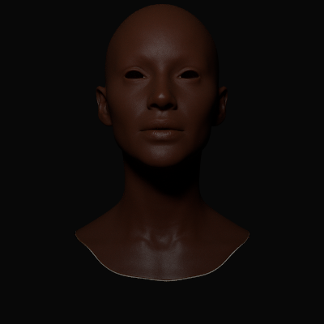
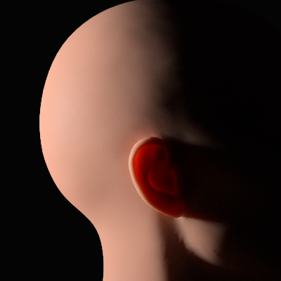

# Physically-Based Skin Renderer & Synthetic 3D Data Pipeline

A from-scratch, GPU-accelerated path tracer for photorealistic human skin, built on a
two-layer subsurface scattering model — and a synthetic data pipeline that turns it into
posed, denoised multi-view datasets for 3D reconstruction (NeRF / Gaussian Splatting).

Written in Python + [Taichi](https://www.taichi-lang.org/) (CUDA backend). 

<!-- Suggested hero image: the backlit ear shot (deep red transmission through cartilage). -->
<!--  -->
### Backlit ear - subsurface transimission


---

## TWO PHASES


Photoreal skin is the standard stress test for a renderer: it needs subsurface scattering,
a wavelength-dependent medium, a dielectric surface layer, and energy-conserving specular —
all at once. Getting it right end-to-end demonstrates control of the full physically-based
rendering stack.

The second half of the project reframes the renderer as a **synthetic data generator**:
render a 3D asset from 100 known camera poses, denoise each frame, and export a
reconstruction-ready dataset. This is the core loop behind training data for modern
3D/4D foundation models.

---

## Results


<!-- Put a few renders here. Suggested set: -->
<!-- 1. Front portrait, evenly lit. -->
<!-- 2. The backlit ear (the SSS money shot). -->
<!-- 3. A noisy vs. denoised side-by-side (shows the AOV-guided denoiser). -->
<!-- 4. A contact sheet of several NeRF orbit views (front / side / back / top). -->

| | |
|---|---|
|  |  |
| *Even-lit portrait, two-layer SSS* | *Backlit ear: red survives ~2 mm of cartilage while green/blue are absorbed* |

| Noisy (low spp) | Denoised (albedo+normal guided) |
|---|---|
|  |  |

---

## Technical highlights

### Rendering
- **Two-layer subsurface scattering** via brute-force random walk (Chiang et al. 2016 style),
  with a distinct epidermis and dermis shell. Free-flight distances are sampled per colour
  channel with a balance-heuristic mixture pdf (hero-wavelength style), because red light
  travels several times further than blue in skin.
- **Physically-correct interface handling** — refraction into the medium, and a dielectric
  Fresnel *exit* term with total-internal-reflection above the critical angle. Trapped light
  keeps bouncing until it lands inside the escape cone; letting it all out would roughly
  double the skin's brightness.
- **Energy-conserving specular** — GGX with height-correlated Smith visibility, plus a
  Kulla–Conty / Turquin multiple-scattering compensation term (precomputed 32×32 albedo LUT)
  that restores the energy single-scatter GGX loses on rough surfaces.
- **Multiple Importance Sampling** — light sampling and BSDF sampling combined with the power
  heuristic, across an arbitrary number of area lights.
- **Correct colour management** — sRGB-decoded albedo, linear light transport, tonemap +
  sRGB encode on output. (A subtle but common bug: skin albedo is ~2× too bright if you skip
  the decode, and the error compounds once per scattering event.)

### Geometry & acceleration
- **From-scratch BVH** (median split, flattened to arrays for the GPU) with an ordered,
  stackless-friendly traversal that culls against the closest hit.
- **Möller–Trumbore** intersection, two-sided (subsurface exit rays hit triangles from
  inside).
- **Robust mesh preprocessing** — watertight hole-capping with correct winding, area-weighted
  vertex normals, Gram–Schmidt tangents with handedness for mirrored UVs, and a signed-volume
  check that aborts on inside-out geometry. Millimetre unit scaling so published scattering
  coefficients apply directly.
- **Multi-mesh scene** — the head (with its inner dermis shell) plus separate eyeball meshes,
  each with its own BVH and material path.

### Materials & assets
- Tangent-space normal mapping, per-texel roughness and specular, sRGB-aware texture loading
  at multiple bit depths.
- A dedicated eye material (diffuse iris/sclera + tight dielectric highlight, no subsurface),
  loaded from a separate mesh and texture set.

### Synthetic data pipeline
- **AOV-guided denoising** — the renderer emits noise-free albedo and normal buffers from a
  single primary-ray pass; these guide Intel Open Image Denoise so pores, edges and iris
  detail survive rather than smearing. Denoising is applied to *linear* radiance before the
  tonemap.
- **Multi-view export** — cameras are placed on a full sphere (Fibonacci spiral) around the
  asset, lights fixed in world space so illumination is view-consistent (a hard requirement
  for reconstruction). Each view is rendered, denoised, and written out with its exact
  camera-to-world pose.
- **`transforms.json`** in the standard NeRF/OpenGL convention — every pose validated
  orthonormal, right-handed, and aimed at the scene centre — so the dataset drops into a
  reconstruction pipeline with no coordinate surgery and no COLMAP step.

---

## Pipeline

```
OBJ mesh ─▶ preprocess ─▶ BVH ─▶ path-traced render ─▶ AOV-guided denoise ─▶ posed dataset
           (cap holes,    (head +   (SSS + specular      (albedo/normal        (images/ +
            normals,       eyes)     + MIS lighting)       guide buffers)        transforms.json)
            tangents,
            mm scale)
```

---

## Repository layout

| Module | Responsibility |
|---|---|
| `load_obj.py` | OBJ parsing (vertices, UVs, faces) |
| `helpers.py` | Normals, tangents, hole-capping, signed-volume validation |
| `bvh.py` | BVH construction and flattening |
| `intersect.py` | Ray–box and ray–triangle intersection |
| `trace.py` | BVH traversal / closest-hit for each mesh |
| `scene.py` | Scene assembly, mesh upload, shell offset, GPU fields |
| `camera.py` | Pinhole camera, ray generation |
| `textures.py` | sRGB-aware texture loading and sampling |
| `brdf.py` | GGX, Smith, Fresnel, energy compensation |
| `sampling.py` | GGX and cosine-hemisphere importance sampling |
| `lighting.py` | Multi-light area sampling, MIS, shadow rays |
| `sss.py` | Two-layer subsurface random walk |
| `medium.py` | Optical coefficients / albedo inversion |
| `eye.py` | Eyeball geometry and material |
| `shading.py` | Interpolation, normal-map application |
| `radiance.py` | The integrator — ties surface, subsurface, and lighting together |
| `denoise.py` | Open Image Denoise wrapper (albedo/normal guided) |
| `main.py` | Single-frame render + denoise |
| `render_nerf.py` | Multi-view orbit, dataset + `transforms.json` export |

---

## Usage

Requires an NVIDIA GPU (CUDA). Dependencies: `taichi`, `numpy`, `imageio`, `oidn`.

```bash
uv sync                      # or: pip install taichi numpy imageio oidn
```

**Single render:**
```bash
uv run main.py               # writes a rendered + denoised frame
```

**Generate a multi-view dataset:**
```bash
uv run render_nerf.py        # writes nerf/images/*.png and nerf/transforms.json
```

Render settings (resolution, samples-per-pixel, exposure, lights, camera) are set at the top
of `main.py` / `render_nerf.py`.

> **Note on Open Image Denoise on a cluster:** OIDN needs Intel TBB on the library path. If
> `import oidn` fails with `libtbb.so.12 not found`, install `tbb` and prepend its directory
> to `LD_LIBRARY_PATH`.

---

## Downstream: 3D reconstruction

The exported dataset (`nerf/images/` + `nerf/transforms.json`) is consumed by a separate
NeRF / 3D Gaussian Splatting repository. This repo is responsible for the **renderer and the
data pipeline** — the physically-based image generation, the camera orbit, the denoising, and
the posed export. The reconstruction model lives elsewhere.

<!-- Link the reconstruction repo here once it's public. -->

---

## Notes & references

- Chiang, Kulla et al. — *Practical and Controllable Subsurface Scattering for Production
  Path Tracing* (2016)
- Turquin — *Practical multiple scattering compensation for microfacet models* (2019)
- Heitz — height-correlated Smith masking-shadowing
- Veach — Multiple Importance Sampling
- Möller & Trumbore — fast ray–triangle intersection

Head and eye scan assets are from a third-party scan store and are not redistributed here;
paths in the code expect them under `Head.obj`, `OBJ/`, and `TGA/`.